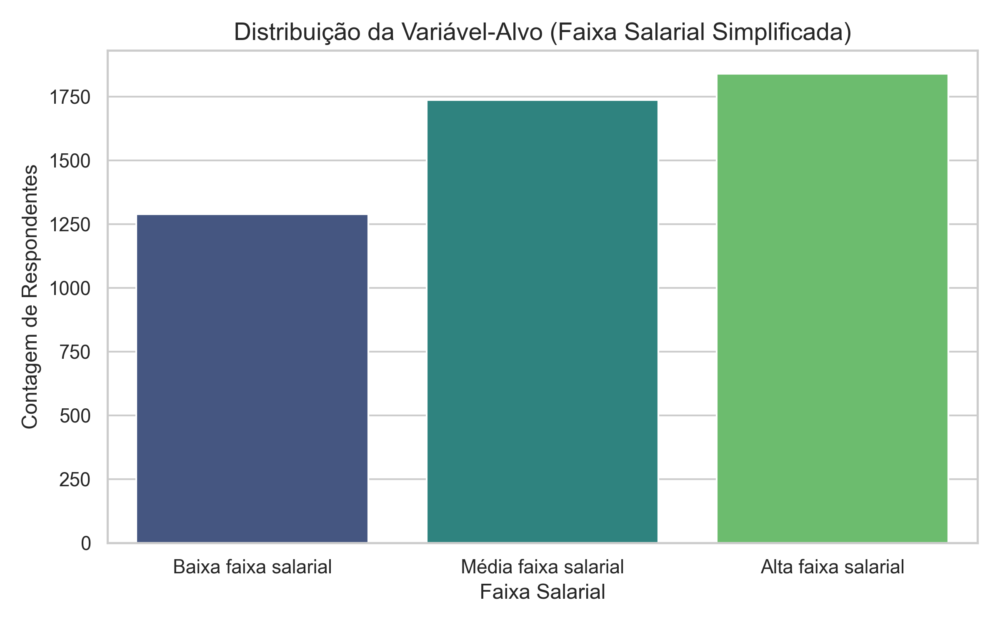
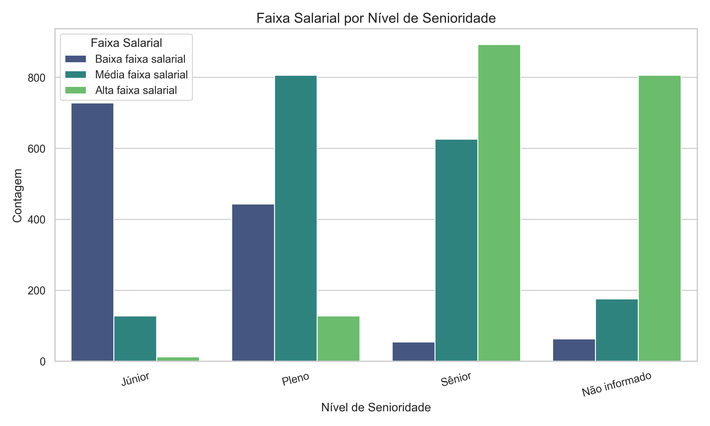
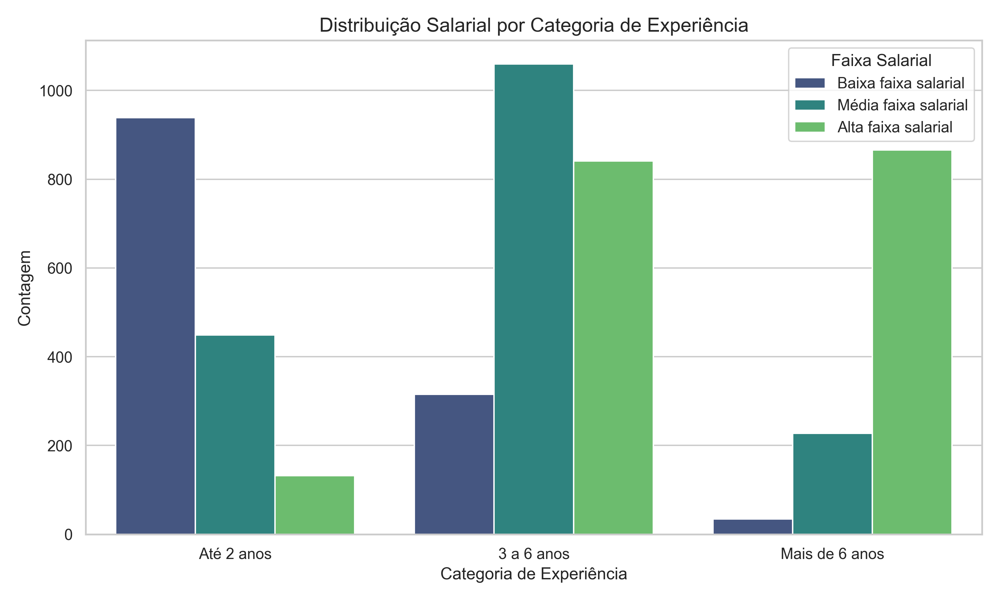
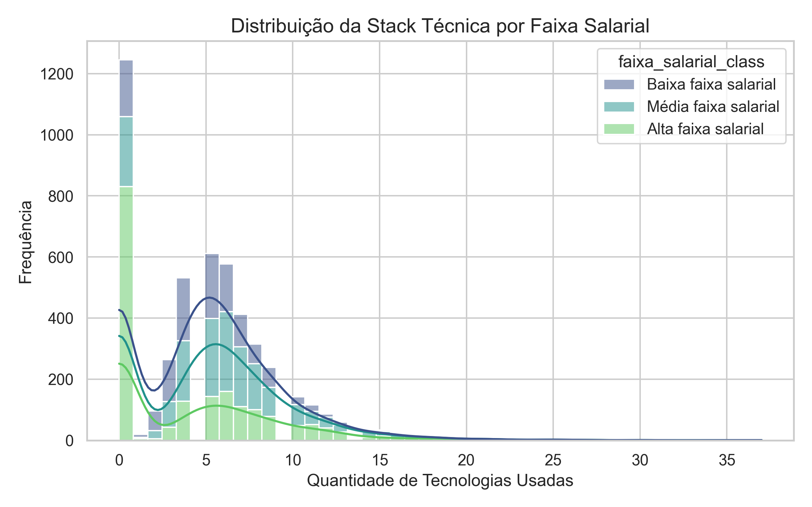
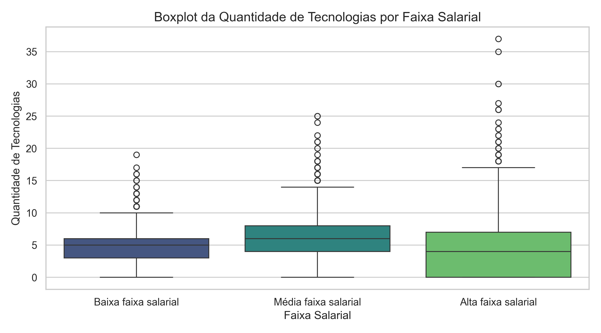
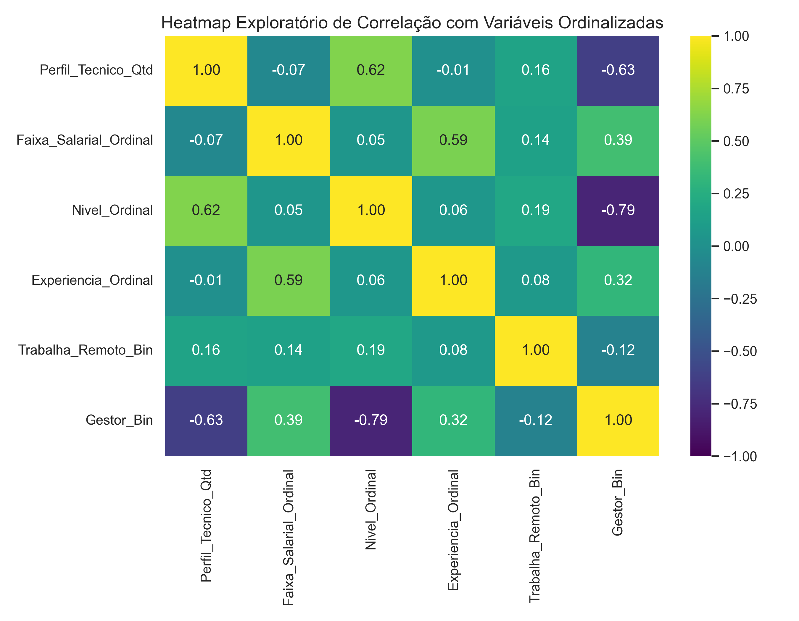
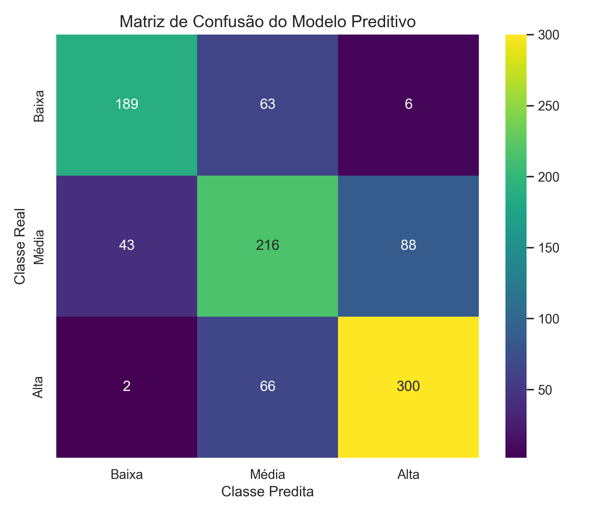

# FACULDADE DE TECNOLOGIA DE JUNDIAÍ

# RODOLFO VINICIUS CIMA TAKEMOTO
# TIAGO GALHARDO AVELAR

   

# PREDIÇÃO DE FAIXA SALARIAL DE PROFISSIONAIS DE DADOS NO BRASIL COM MACHINE LEARNING

   

Jundiaí 
2026

---

# RODOLFO VINICIUS CIMA TAKEMOTO
# TIAGO GALHARDO AVELAR

   

# PREDIÇÃO DE FAIXA SALARIAL DE PROFISSIONAIS DE DADOS NO BRASIL COM MACHINE LEARNING

Relatório técnico apresentado à disciplina de Inteligência Computacional, da Faculdade de Tecnologia de Jundiaí, como parte das atividades acadêmicas relacionadas à aplicação de técnicas de Aprendizado de Máquina supervisionado.

Professor: Me. Mateus Guilherme Fuini

  

Jundiaí 
2026

---

# RESUMO

Este trabalho apresenta o desenvolvimento de um pipeline de Aprendizado de Máquina supervisionado para classificar a faixa salarial de profissionais brasileiros da área de dados. A base utilizada foi a pesquisa State of Data Brazil 2024-2025, composta originalmente por 5.217 respondentes e mais de 400 variáveis. O estudo selecionou atributos demográficos, acadêmicos, profissionais e tecnológicos, além de variáveis derivadas relacionadas à experiência, ao trabalho remoto e à quantidade de tecnologias utilizadas. A variável-alvo foi simplificada em três classes: baixa, média e alta faixa salarial. O modelo final adotado foi uma Regressão Logística otimizada por validação cruzada estratificada, alcançando 73,47% de acurácia média na validação cruzada e 72,46% de acurácia no conjunto de teste. Os resultados indicam melhor desempenho nas classes salariais extremas e maior dificuldade na classificação da faixa média, o que é coerente com a sobreposição de perfis profissionais no mercado brasileiro de dados.

**Palavras-chave:** Aprendizado de Máquina; Ciência de Dados; Classificação; Faixa Salarial; State of Data.

---

# ABSTRACT

This paper presents the development of a supervised Machine Learning pipeline to classify the salary range of Brazilian data professionals. The dataset used was the State of Data Brazil 2024-2025 survey, originally composed of 5,217 respondents and more than 400 variables. The study selected demographic, academic, professional, and technological attributes, as well as engineered variables related to experience, remote work, and the number of technologies used. The target variable was simplified into three classes: low, medium, and high salary range. The final model adopted was a Logistic Regression optimized through stratified cross-validation, achieving 73.47% mean accuracy in cross-validation and 72.46% accuracy on the test set. The results indicate stronger performance in the extreme salary classes and greater difficulty in classifying the medium salary range, which is consistent with the overlap of professional profiles in the Brazilian data job market.

**Keywords:** Machine Learning; Data Science; Classification; Salary Range; State of Data.

---

# SUMÁRIO

1. Introdução 
2. Fundamentação e Caracterização do Problema 
3. Materiais e Métodos 
4. Resultados e Discussão 
5. Limitações 
6. Conclusão 
Referências

---

# 1 INTRODUÇÃO

A área de dados no Brasil reúne profissionais com diferentes trajetórias, formações, cargos, níveis de senioridade e contextos de contratação. Essa diversidade torna a análise salarial um problema relevante tanto para profissionais que buscam orientar suas carreiras quanto para empresas que desejam estruturar políticas de remuneração mais compatíveis com o mercado.

O presente trabalho tem como objetivo construir, otimizar e avaliar um modelo de Aprendizado de Máquina supervisionado capaz de classificar profissionais de dados em três faixas salariais: baixa, média e alta. Para isso, utiliza-se a pesquisa State of Data Brazil 2024-2025, uma das principais fontes públicas sobre o mercado brasileiro de dados.

# 2 FUNDAMENTAÇÃO E CARACTERIZAÇÃO DO PROBLEMA

O problema tratado é caracterizado como uma tarefa de classificação multiclasse. A variável de interesse corresponde à faixa salarial declarada pelos respondentes, enquanto as variáveis preditoras representam aspectos demográficos, acadêmicos, profissionais e tecnológicos. Entre os fatores considerados estão senioridade, experiência, região, formação, setor econômico, tamanho da empresa, modelo de trabalho e cargo exercido.

A opção por classificar faixas salariais, em vez de prever valores monetários exatos, é adequada ao formato do questionário original e reduz a sensibilidade do modelo a variações individuais extremas. Além disso, o agrupamento da variável-alvo em três classes diminui a esparsidade e favorece uma análise mais estável do desempenho preditivo.

# 3 MATERIAIS E MÉTODOS

## 3.1 Base de dados

A base utilizada foi o State of Data Brazil 2024-2025, promovido pela comunidade Data Hackers em parceria com a Bain & Company. O arquivo bruto possui originalmente 5.217 respondentes e mais de 400 variáveis, incluindo dados demográficos, formação acadêmica, situação profissional, cargo, senioridade, remuneração e uso cotidiano de tecnologias.

**Tabela 1 - Distribuição das instâncias após tratamento**

| Partição | Instâncias |
| :--- | ---: |
| Treino | 3.890 |
| Teste | 973 |
| Total modelado | 4.863 |

Fonte: Elaborado pelos autores (2026).

**Tabela 2 - Distribuição das classes no conjunto de teste**

| Classe no conjunto de teste | Instâncias |
| :--- | ---: |
| Alta faixa salarial | 368 |
| Média faixa salarial | 347 |
| Baixa faixa salarial | 258 |

Fonte: Elaborado pelos autores (2026).

## 3.2 Variável-alvo

A variável original de salário contém 13 intervalos de renda mensal. Para viabilizar uma classificação mais robusta, esses intervalos foram agrupados em três classes: baixa faixa salarial, média faixa salarial e alta faixa salarial.

**Tabela 3 - Agrupamento da variável-alvo**

| Intervalo original | Classe simplificada |
| :--- | :--- |
| Até R$ 6.000/mês | Baixa faixa salarial |
| De R$ 6.001/mês a R$ 12.000/mês | Média faixa salarial |
| Acima de R$ 12.000/mês | Alta faixa salarial |

Fonte: Elaborado pelos autores (2026).

## 3.3 Seleção e engenharia de atributos

O conjunto final de preditores foi composto por variáveis relacionadas ao perfil do respondente e ao contexto de atuação profissional. Foram utilizadas variáveis como gênero, escolaridade, região, situação de trabalho, setor, tamanho da empresa, cargo, nível de senioridade, experiência categorizada, trabalho remoto e quantidade de tecnologias.

Foram criadas três variáveis derivadas: `Experiencia_Categoria`, que agrupa o tempo de atuação em dados; `Trabalha_Remoto`, que identifica atuação 100% remota; e `Perfil_Tecnico_Qtd`, que representa a soma das tecnologias utilizadas no cotidiano.

## 3.4 Pipeline de modelagem

O pré-processamento foi encapsulado por meio de `ColumnTransformer` e `Pipeline`, evitando vazamento de dados entre treino e teste. A variável numérica `Perfil_Tecnico_Qtd` recebeu imputação por mediana, tratamento de outliers por capping baseado em IQR e padronização com `StandardScaler`. As variáveis categóricas receberam imputação por moda e codificação `OneHotEncoder` com tratamento de categorias desconhecidas.

O modelo final foi uma Regressão Logística. Os hiperparâmetros foram ajustados com `GridSearchCV`, utilizando validação cruzada estratificada com cinco partições. A métrica de otimização foi a acurácia.

# 4 RESULTADOS E DISCUSSÃO

**Tabela 4 - Métricas gerais do modelo**

| Métrica | Resultado |
| :--- | ---: |
| Acurácia média na validação cruzada | 73,47% |
| Desvio padrão da validação cruzada | 1,69% |
| Acurácia no conjunto de teste | 72,46% |

Fonte: Elaborado pelos autores (2026).

**Tabela 5 - Relatório de classificação no conjunto de teste**

| Classe | Precisão | Recall | F1-score | Suporte |
| :--- | ---: | ---: | ---: | ---: |
| Alta faixa salarial | 0,76 | 0,82 | 0,79 | 368 |
| Baixa faixa salarial | 0,81 | 0,73 | 0,77 | 258 |
| Média faixa salarial | 0,63 | 0,62 | 0,62 | 347 |

Fonte: Elaborado pelos autores (2026).

Os resultados indicam desempenho mais consistente nas classes extremas. A classe alta faixa salarial apresentou F1-score de 0,79, enquanto a classe baixa faixa salarial apresentou F1-score de 0,77. A classe média faixa salarial obteve F1-score de 0,62, indicando maior dificuldade de separação entre os perfis.

A maior ambiguidade na faixa média é compatível com o mercado brasileiro de dados, no qual profissionais plenos, seniores, especialistas e gestores podem ter perfis próximos, mas remunerações diferentes conforme região, porte da empresa, regime de contratação e cargo exercido.

**Figura 1 – Distribuição da variável-alvo em faixas salariais**

Fonte: Elaborado pelos autores (2026).

**Figura 2 – Faixa salarial por nível de senioridade**

Fonte: Elaborado pelos autores (2026).

**Figura 3 – Distribuição salarial por categoria de experiência**

Fonte: Elaborado pelos autores (2026).

**Figura 4 – Distribuição da stack técnica por faixa salarial**

Fonte: Elaborado pelos autores (2026).

**Figura 5 – Boxplot da quantidade de tecnologias por faixa salarial**

Fonte: Elaborado pelos autores (2026).

**Figura 6 – Heatmap exploratório de correlação entre variáveis selecionadas**

Fonte: Elaborado pelos autores (2026).

**Figura 7 – Matriz de confusão do modelo preditivo**

Fonte: Elaborado pelos autores (2026).

# 5 LIMITAÇÕES

O estudo utiliza respostas voluntárias declaradas pelos participantes, o que pode introduzir vieses de amostragem, autopreenchimento e representatividade. Além disso, a simplificação da variável-alvo em três classes reduz ruído, mas também elimina parte da granularidade salarial presente no questionário original.

Outra limitação está na escolha do modelo. A Regressão Logística é adequada como modelo interpretável e baseline acadêmico, porém possui menor capacidade de capturar relações não lineares e interações complexas entre variáveis, quando comparada a modelos baseados em árvores.

# 6 CONCLUSÃO

O projeto atingiu o objetivo de construir e avaliar um pipeline supervisionado para classificar a faixa salarial de profissionais de dados no Brasil. A acurácia de 72,46% no conjunto de teste indica desempenho consistente para um problema tabular com variáveis majoritariamente categóricas e com forte sobreposição entre perfis profissionais.

Como trabalho acadêmico, o projeto demonstra domínio das etapas de Ciência de Dados, incluindo entendimento do problema, seleção de variáveis, engenharia de atributos, prevenção de vazamento de dados, validação cruzada, avaliação por métricas e análise crítica das limitações. Como continuidade, recomenda-se testar modelos baseados em árvores, salvar o pipeline treinado e ampliar a explicabilidade dos atributos utilizados.

# REFERÊNCIAS

DATA HACKERS; BAIN & COMPANY. **State of Data Brazil 2024-2025**. Kaggle, 2025. Disponível em: <https://www.kaggle.com/datasets/datahackers/state-of-data-brazil-20242025>. Acesso em: 27 maio 2026.

HUNTER, John D. Matplotlib: A 2D graphics environment. **Computing in Science & Engineering**, v. 9, n. 3, p. 90-95, 2007.

MCKINNEY, Wes. Data structures for statistical computing in Python. In: **Proceedings of the 9th Python in Science Conference**. Austin: SciPy, 2010. p. 56-61.

PEDREGOSA, Fabian et al. Scikit-learn: machine learning in Python. **Journal of Machine Learning Research**, v. 12, p. 2825-2830, 2011.
